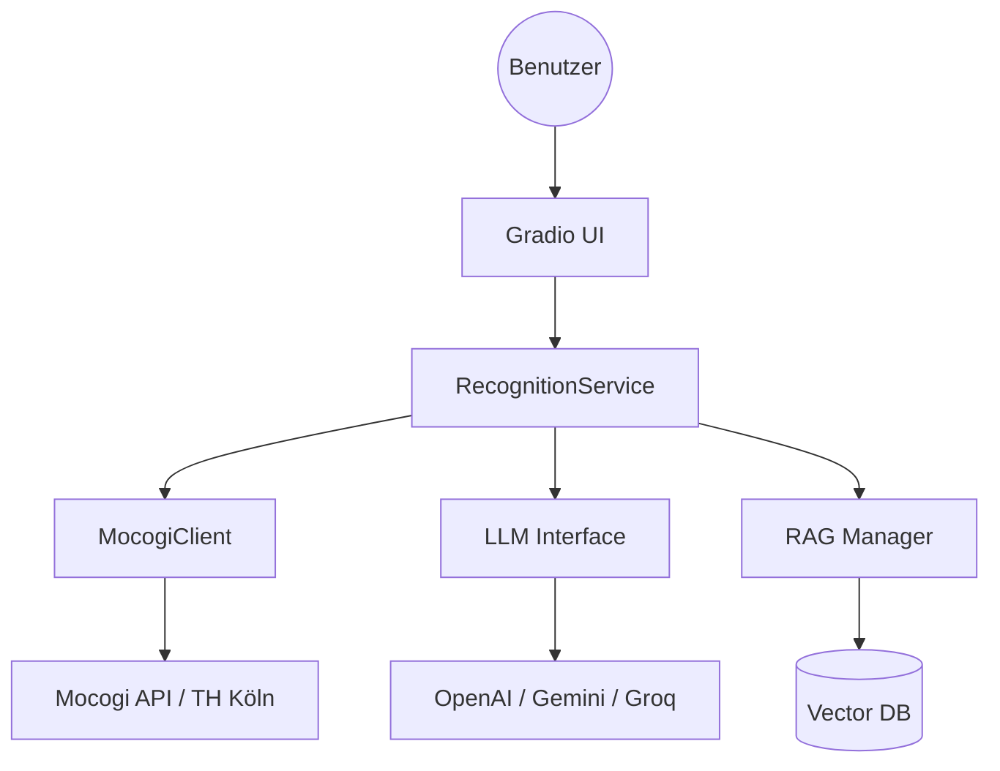

# Architektur

Das Modul-Anerkennungstool ist als modulare Python-Anwendung konzipiert, die externe APIs (LLMs und Mocogi) integriert.

## Systemübersicht

## Datenfluss: Anerkennungsprozess

1.  **Eingabe**: Der Benutzer gibt eine externe Modulbeschreibung ein.  
2.  **Extraktion**: Das LLM analysiert den Text und extrahiert Metadaten (Name, ECTS, Keywords).  
3.  **Suche**: Der `MocogiClient` nutzt das Model Context Protocol (MCP), um in der TH Köln Datenbank nach ähnlichen Modulen zu suchen.  
4.  **Vergleich**: Für die Top-Treffer generiert das LLM einen detaillierten Vergleichsbericht.  
5.  **Entscheidung**: Der Benutzer wählt Module für den Anerkennungsantrag aus.  

## Kernkomponenten

*   **RecognitionService**: Orchestriert die Logik zwischen GUI, MCP und LLM.  
*   **MocogiClient**: Kommuniziert über MCP mit dem Mocogi-Server.  
*   **LLMInterface**: Abstraktionsschicht für verschiedene Sprachmodelle über `llm_client`.  
*   **Models**: Pydantic-Modelle zur Validierung und Typisierung der Daten.  
